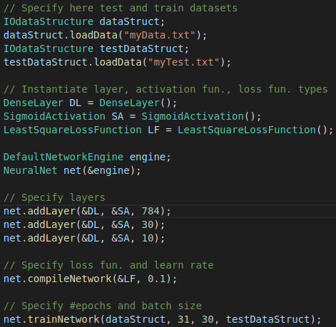
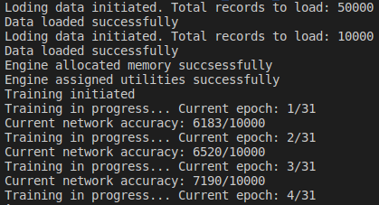
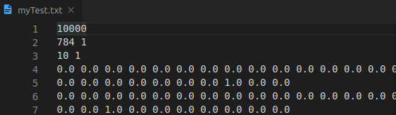
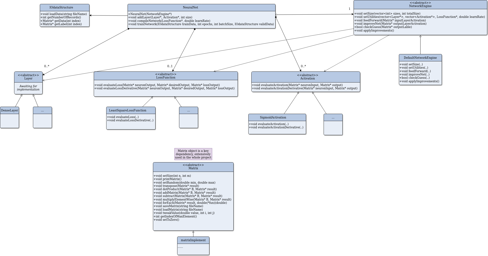

# Description

This application provides Keras-like library for machine learning. Currently it supports Feedforward Neural Network with sigmoid activation function and least square loss function. Backpropagation is based on stochastic gradient descent.

## How to run app

1. Clone this repository.
2. Unzip 'data.zip'.
3. Compile and run with MS Visual Studio (Windows) or build with 'make' and run 'a.out' (Linux).

## How it works

User can edit 'main.cpp' and rebuild project tailored to the needs, i.e. choose dataset, number of layers and their size, tweak hyperparameters.

## User stories

This version allows users for:
- choosing train & test dataset
- specifying number of layers and their size
- define learn rate
- specifying number of epochs and batch size 

## How does the app look like

As for now, training progression is displayed in a console every epoch. 

## Dataset format

User can provide their own datasets which are loaded from text files. Input files must be formatted in the following way:
- number of samples
- matrix size of input features
- matrix size of a label
- data-label pairs in separate lines
<!-- -->
The application comes together with MNIST handwritten dataset, formated in a described above manner. 

## Under the hood

The whole library was design to allow for easy future extension of available activation & loss functions. It encapsulates feed-forward and backpropagation algorithms in NetworkEngine class. User interacts with API of NeuralNet which was inspired by Sequential model from Keras.
Code structure can be seen on the UML class diagram below: 

